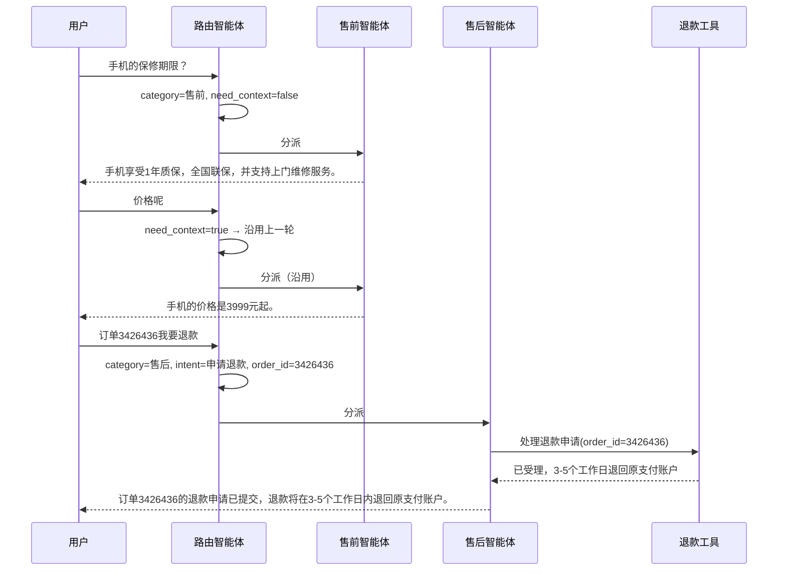
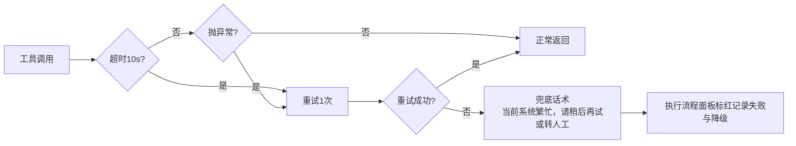

> **参考实现**：本节所有技术选型都是**可替换**的。用 Spring AI、LangGraph、AutoGen 重做一遍同样能通过 `prd.md` §4 的验收。标 `【硬要求】` 的才是不能变的。

# PLAN-参考组-001｜方案设计

## 1. 系统边界与外部依赖事实

假设存在但**本次全部 mock** 的外部系统：

| 外部系统 | mock 方式 | 边界说明 |
|---|---|---|
| 商品系统 | `data/products.json`（3 条） | 只提供"按商品名查价格/库存/特性"，不做搜索、不做比价 |
| 订单系统 | `data/orders.json`（5 条，含 `3426436`） | 提供按 `order_id` 查询、改地址、标记退款状态；进程内读写，重启即还原 |
| 物流系统 | 并入订单系统 mock | 物流状态是订单表的一个字段，不单独建服务 |
| 支付/退款系统 | `tools/refund.py` 内的假实现 | 只改订单表的退款状态字段，不涉及真实资金 |
| 政策库 | `data/policies.json`（2 条） | 包邮规则、7天无理由退货规则 |

真实存在、由外部约定的东西：**DeepSeek API**（Key 走 `.env`，不入库）。

> 「哪些东西不能碰」统一写在 §6 不改清单，这里不重复列。

## 2. 方案选型（含被否决方案）

### 2.1 多智能体框架

**选择：自研 Router + Function Calling**（Python，直接调 DeepSeek 的 OpenAI 兼容接口）

理由：3 小时窗口里，框架的学习成本和调试成本都是纯损耗；本题只有"一个路由 + 三个子智能体"，自己写不到 200 行，且出问题时堆栈直接可读。

**被否决：LangGraph**——Agent 起草时选的是它。否决理由：组内无人用过，图状态机的调试成本在 80 分钟编码窗口里风险太高。若时间是 2 天，LangGraph 的状态管理和可视化反而更合适。

**被否决：Spring AI**——组内主力语言是 Python；若是 Java 团队，这会是首选。

### 2.2 路由方式

**选择：LLM 单次分类，一次调用同时输出「分类 + 抽取到的参数」**

```json
{"category": "售后咨询", "intent": "申请退款", "order_id": "3426436", "need_context": false}
```

理由：比"先分类、再由子智能体抽参数"少一次 LLM 往返，直接把每轮延迟砍掉约 40%（`spec.md` §8 记的风险点）。

**被否决：纯规则匹配（关键词）**——`spec.md` §2.2 的"价格呢"和测试用例里"这手机拍照清楚吗"都没有可匹配的关键词，纯规则过不了 US-04 的 85%。

**被否决：规则 + LLM 混合**——规则先兜住高频词、剩下的交给 LLM。效果可能更好，但要维护两套逻辑且边界难划，3 小时内不值得。

### 2.3 上下文延续

由路由输出的 `need_context` 字段决定：LLM 判断当前这句话**能否独立成立**，不能则沿用上一轮的智能体（对应 `spec.md` §2 的规则）。会话历史保留最近 6 轮，仅存内存。

## 3. 数据模型与代码结构

### mock 数据结构

```jsonc
// data/orders.json
{
  "3426436": {
    "order_id": "3426436",
    "product": "手机",
    "status": "已发货",          // 待发货 / 已发货 / 已签收
    "logistics": "运输中，当前在广州转运中心",
    "address": "广东省广州市天河区XX路1号",
    "refund_status": "无"        // 无 / 退款中 / 已退款
  }
}

// data/products.json
{ "手机": { "price": "3999元起", "stock": "有货", "warranty": "1年质保，全国联保，支持上门维修", "camera": "5000万像素主摄，支持光学防抖" } }

// data/policies.json
{ "包邮": "满99元包邮，偏远地区除外", "无理由退货": "支持7天无理由退货，商品需保持完好" }
```

### `src/` 目录结构

```
src/
  app.py                 Flask 入口：/chat（POST）与 /stream（SSE 推执行流程）
  router.py              路由智能体：分类 + 参数抽取 + need_context
  agents/
    presale.py           售前咨询智能体
    aftersale.py         售后咨询智能体
    chitchat.py          闲聊智能体（兼兜底出口）
  tools/
    __init__.py          工具注册表 + 统一的超时/重试/故障注入包装
    order.py             查物流、改地址
    refund.py            处理退款申请
    product.py           查价格、库存、特性
    policy.py            查平台政策
  trace.py               执行流程事件记录（对应 US-05）
  data/*.json            mock 数据
  tests/run_eval.py      跑 eval.md §1.1 的用例，输出准确率
  static/index.html      三栏 UI
  README.md              启动说明
```

## 4. 关键流程

Golden Path（对应 `prd.md` §7、`spec.md` §2.2）：



降级流程（对应 US-03）：



## 5. 扩展性策略

如果评审现场要求再加一类意图（比如"投诉建议"）：

- **要改的**：路由提示词里的分类枚举加一项、`agents/` 下加一个文件、注册表加一行——约 20 行
- **不用改的**：路由逻辑、工具层、降级机制、执行流程面板

这正是选"路由 + 子智能体"而非"单 Agent 大提示词"的收益。若是单 Agent，加一类意图要动那段已经很长的提示词，还得回归测试所有旧场景。

## 6. 不改清单（Do-Not-Touch，Coding Agent 硬约束）

编码时**不允许 Agent 自行改动**：

- `spec.md` §5 的验收标准（US-01…US-06）文字
- `prd.md` §7 的 Golden Path 对话——**实现可以变，但这三轮问答期望产生的效果不能变**
- **mock 订单号 `3426436`**——`prd.md` §7 写死了它，改了现场演示直接对不上
- **Golden Path 的三句回复措辞**（"1年质保，全国联保，支持上门维修""3999元起""3-5个工作日内退回原支付账户"）——可以调整句式，但这三个关键信息点不能少
- 已选定的需求分类范围（`spec.md` §3）——不许 Agent"顺手"多做取消订单、发票申请
- `.env` 与 `.env.example`：**任何情况下不得把真实 Key 写进代码或提交进仓库**

**Agent 起草时必须附上盲区清单**：

| 我不确定该不该锁的东西 | 锁了的代价 / 不锁的风险 | 人裁决 |
|---|---|---|
| mock 数据里的订单号 `3426436` | 锁：不能改测试数据；不锁：Agent 可能顺手换成别的号，Golden Path 演示当场对不上 | ☑ **锁**（人补充：Agent 原稿漏了这条） |
| 三栏 UI 的布局结构 | 锁：样式没法优化；不锁：可能被重构成单栏，US-05"执行过程可见"就没了 | ☑ 锁"三个区域都要在"，具体样式不锁 |
| 退款回复里的"3-5个工作日" | 锁：话术不能调；不锁：Agent 可能改成"1-3个工作日"，与 PRD 演示脚本不符 | ☑ 锁信息点，不锁句式 |
| `tools/` 的函数签名 | 锁：重构不便；不锁：改了 `tests/run_eval.py` 会挂 | ☐ 不锁——编码期本来就要调整，但改了要同步测试脚本 |

## 7. 风险与回滚

- **LLM 返回的 JSON 解析失败** → 降级到"兜底"分类，不抛异常；记录到执行流程面板便于排查
- **DeepSeek 接口不可用** → Plan B：路由降级为关键词规则匹配（准确率会掉，但演示不中断）。`FORCE_LLM_FAILURE=true` 可现场演示这条
- **三栏 UI 来不及做** → Plan B：`/chat` 接口 + 命令行输出执行流程，仍满足 US-05（`prd.md` §3 明确允许命令行 Demo）
- **80 分钟编码窗口不够** → 优先级：T-01~T-05 必做 > 前端 UI > 闲聊智能体

## 8. 变更记录

| 时间 | 改动 | 人 |
|---|---|---|
| 08-17 09:30 | Coding Agent 基于确认版 spec.md 起草初稿 | Agent |
| 08-17 09:38 | **纠错**：框架选型原为 LangGraph，改为自研 Router——组内无人用过，80 分钟编码窗口担不起学习成本。被否决方案与理由保留在 §2.1 | 张三 |
| 08-17 09:41 | **纠错**：原方案路由与参数抽取分两次 LLM 调用，合并为一次——现场网络下每轮省约 40% 延迟 | 王五 |
| 08-17 09:44 | **补充**：§6 不改清单原稿漏了 mock 订单号 `3426436`。补上，并连带补了"Golden Path 三句回复的关键信息点" | 李四 |
| 08-17 09:46 | **补充**：§7 增加 `FORCE_LLM_FAILURE` 开关，让"LLM 挂了"这条降级路径也能现场演示，不只是纸面方案 | 王五 |
| 08-17 09:47 | 确认，status 改为已确认 | 张三 |
